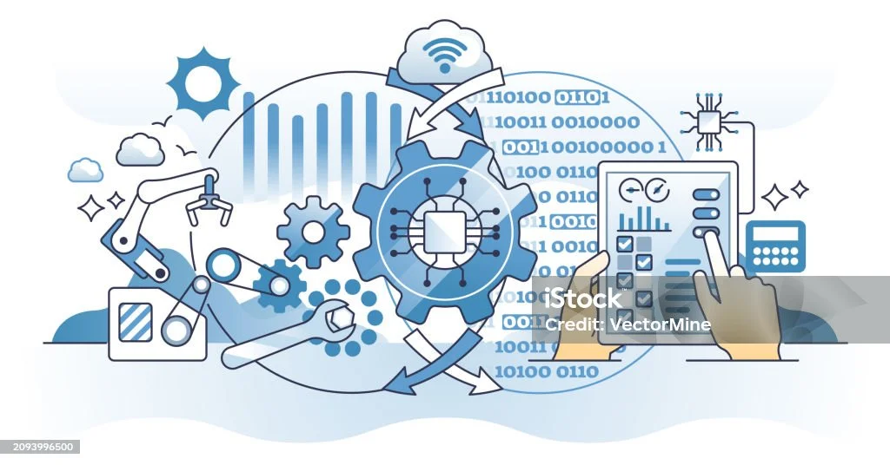

### 🚀 Hi there, I'm Mahamat Allatchi 👋  

<!--

  <picture>
     <source media="(prefers-color-scheme: dark)" srcset="YOUR-DARKMODE-IMAGE">
    <source media="(prefers-color-scheme: light)" srcset="YOUR-LIGHTMODE-IMAGE"> 
    
  </picture>

-->
---

### 👨‍💻 About Me  

Hi! I'm **Mahamat Allatchi**, a passionate **Data Scientist** and **Web Developer**.  
I love solving data-driven problems, building intelligent systems, and creating modern web applications.

- 🔭 **Currently working on:** NLP in **Toubou** language  
- 🌱 **Currently learning:** Deep Learning, Transformers & Large Language Models  
- 💬 **Ask me about:** Data Science, Web Development, and AI  

---

### 🛠️ Technologies & Skills  

#### 💻 Programming Languages  

#### 📊 Data Science & Machine Learning  

#### 🌐 Web Development  

<!--   -->

#### Outils et plateformes

---

### 📌 My Learning Path  

 
Click to expand 📚

 
  | Rank | Technology    |
  |-----:|---------------|
  |  1️⃣  |   Python      |
  |  2️⃣  |   Java        |
  |  3️⃣  |   Data Science |

---

### 📫 Let's Connect!  

---

> _"If we pull together and commit ourselves, then we can push through anything."_  
> — **Mona the Octocat** 🐙

---
